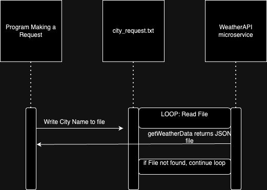

# Read Me 

## Requesting Data
Requesting data from the service is simple. The main file needs to write the requested city to a text file to request weather data from the microservice. The program will then return a JSON file with the requested data. The service merely runs in the background and waits for a file to be requested. 

## Receiving Data
Receiving Data is also simple. The microservice program dumps a JSON file that can be used by the parent file can then reimport. 

## UML Diagram
